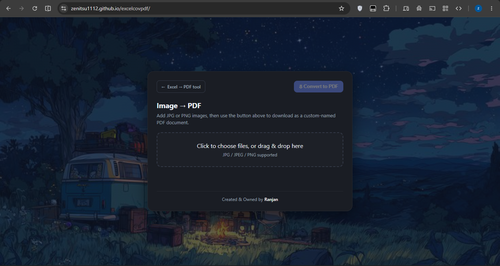

# 📄 Portal Document & Media to PDF Suite


A lightweight, zero-dependency, 100% client-side web utility suite designed to convert portal spreadsheet exports (`.xlsx`) and images (`.jpg`, `.jpeg`, `.png`, `.webp`) into clean, print-ready documents and optimized payloads.

Built specifically to handle the raw XML `NaN` parsing bugs found in government and educational web portal exports (such as **e-Vidyavahini**, **HRMS**, and state administrative reports) that crash standard tools.

---

## 📸 Preview

<p align="center">
  
</p>

---

## 🚀 Live Demo

Deployable on **GitHub Pages** with zero build configuration.  
👉 **[Launch Web Workspace](https://zenitsu1112.github.io/excelcovpdf/)**

---

## 🛠️ How It Solves the Portal `NaN` Bug

Portal data exporters (e.g., e-Vidyavahini, HRMS) frequently serialize missing serial numbers, empty dates, or undefined numeric formulas directly into spreadsheet XML as raw `NaN` strings:

```xml
<!-- Corrupted Portal XML Output inside xl/worksheets/sheet1.xml -->
<row r="2">
    <c r="A2"><v>NaN</v></c>
    <c r="B2" t="s"><v>0</v></c>
    <c r="G2"><v>NaN</v></c>
    <c r="J2" t="s"><v>1</v></c>
</row>
