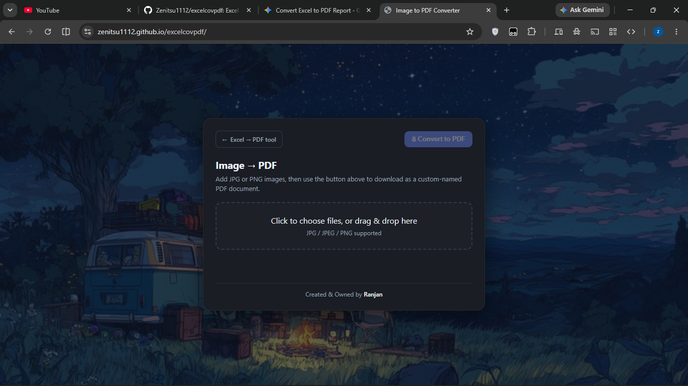

# 📄 Portal Document & Media to PDF Suite

A lightweight, zero-dependency, 100% client-side web utility designed to convert portal spreadsheet exports (`.xlsx`) and images (`.jpg`, `.jpeg`, `.png`) into clean, print-ready PDF documents.

Built specifically to handle the infamous raw XML `NaN` parsing bugs found in government/education web portal exports (such as **e-Vidyavahini**, **HRMS**, and state portal reports).

## 📸 Preview

<p align="center">
  
</p>

---

## 🚀 Live Demo
Deployable on **GitHub Pages** with zero configuration.  
👉 **[View Live Web App](https://zenitsu1112.github.io/excelcovpdf//)** 

---

## ✨ Features

### 1. 📊 Portal Excel to PDF (`excel-to-pdf.html`)
* **Bypasses Portal XML Bugs:** Standard tools like Excel, Python `openpyxl`, and Pandas fail when reading web portal spreadsheets containing invalid `NaN` XML attribute tags. This tool unpacks the `.xlsx` container via `JSZip` and parses the underlying XML directly in-memory.
* **Audit Dashboard & Summary Cards:** Automatically tallies metrics like *Total Applications*, *Approved*, *Pending*, and *Total Days Requested*.
* **Formatted Badges:** Dynamically highlights leave statuses (Green for Approved, Amber for Pending) and formats multiline dates/timestamps.
* **Print-Perfect A4 Landscape:** Generates clean, publication-ready vector PDFs using client-side rendering.

### 2. 🖼️ Image to PDF Converter (`index.html`)
* **Multi-Image Support:** Select or drag & drop single or multiple `.jpg`, `.jpeg`, or `.png` photos at once.
* **Live Thumbnails & Management:** Preview selected images and remove mistakes with a single tap.
* **Smart Orientation & Scaling:** Automatically detects portrait vs. landscape images and scales them proportionately centered on standard A4 canvas.
* **Custom Filename Modal:** Prompts for a custom file name before downloading (`my-scans.pdf`).

### 3. 📱 Mobile-First & Privacy-Focused
* **100% Client-Side:** No files are ever sent to an external server or database. All parsing, canvas rendering, and PDF compilation happen inside the browser sandbox.
* **Fully Responsive:** Optimized touch targets and layout for smartphones, tablets, and desktop displays.

---

## 🛠️ How It Solves the Portal `NaN` Bug

Portal data exporters (e.g., e-Vidyavahini) frequently serialize missing serial numbers or numeric values into `.xlsx` sheet XML files as:

```xml
<!-- Corrupted Portal XML Output -->
<row r="2">
    <c r="A2"><v>NaN</v></c>
    <c r="B2" t="str"><v>TEACHER NAME</v></c>
</row>
